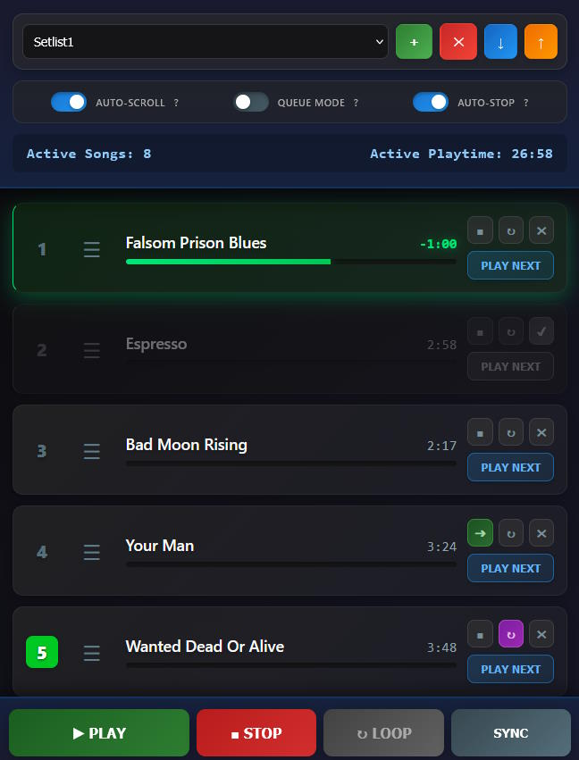

# ReaSetlistManager

A robust, browser-based Setlist Manager designed for live performance with **Cockos REAPER**. 

This web app reads your Reaper project's **Regions** as songs, allowing you to drag-and-drop them into setlists, control playback, and manage song transitions seamlessly from a tablet or laptop.

## 🌟 Key Features

* **Live Region Sync:** Automatically pulls song names and durations from your Reaper project regions.
* **Drag & Drop Sorting:** Visually reorder your setlist on the fly. The order is saved instantly.
* **Setlist Management:** Create, rename, and delete multiple setlists (e.g., "Rehearsal", "Friday Gig").
* **Playback Logic:**
    * **Queue Mode:** Queue the next song to start seamlessly when the current one finishes.
    * **Auto-Stop:** Automatically stop playback at the end of a song.
    * **Follow Actions (Chaining):** Link specific songs together to play continuously (overriding Auto-Stop), allowing for custom mini-sets or medleys.
* **Visual Feedback:** Large progress bars and active song highlighting.
* **Data Persistence:** All setlists and settings are saved automatically to your browser's Local Storage.
* **Backup:** Export and Import your setlist data via JSON files.
* **Touch Optimized:** Designed with large tap targets for iPads/Android tablets.

## 🛠️ Installation

1.  **Locate Reaper's Web Root:**
    * Open Reaper.
    * Go to **Options** > **Show REAPER resource path in explorer/finder**.
    * Open the folder `UserPlugins` > `reaper_www_root`.
2.  **Install File:**
    * Place the `ReaSetlistManager.html` file into this folder.
3.  **Configure Reaper:**
    * Go to **Preferences** > **Control/OSC/Web**.
    * Click **Add**.
    * **Control surface mode:** `Web Browser Interface`.
    * **Default Interface:** `ReaSetlistManager.html`.
    * **Access URL:** Note the address provided (usually `http://localhost:8080`).
    * Click **OK**.

## 🚀 How to Use

### 1. Preparing Your Project
This tool reads **Regions**, not tracks or markers.
1.  In Reaper, make a time selection around a song.
2.  Press `Shift` + `R` to create a Region.
3.  Name the Region (e.g., "Song 1").
4.  Repeat for all songs.

### 2. The Web Interface
Open the Access URL on your tablet or browser.

#### Transport Controls
* **PLAY / STOP:** Standard transport controls.
* **RESYNC (↻):** If the connection drops or the tablet wakes from sleep, click this to restart the data stream without reloading the page.

#### Toggle Switches
* **Auto-Scroll:** Keeps the currently playing song centered on the screen.
* **Queue Mode:** * *ON:* Clicking "PLAY NEXT" waits for the current song to finish, then jumps.
    * *OFF:* Clicking "PLAY NEXT" jumps immediately.
* **Auto-Stop:**
    * *ON:* Playback stops at the end of the region.
    * *OFF:* Playback continues linearly along the timeline.

#### Song List Controls
* **Drag Handle (☰):** Grab this to reorder songs.
* **Chain Button (■ / ➔):** * **Square (■):** Default. The song obeys the global Auto-Stop setting.
    * **Green Arrow (➔):** Active. When this song finishes, it will **immediately** trigger the next song in the list, regardless of Auto-Stop settings. Use this for segues.
* **PLAY NEXT:** Queues or plays the specific song.

### 3. Managing Setlists
* **Dropdown:** Select different saved setlists.
* **(+) Button:** Create a new setlist (clones the current order).
* **(x) Button:** Delete the current setlist.
* **(↓) Export:** Download a `.json` backup of all your setlists and settings.
* **(↑) Import:** Restore setlists from a `.json` file (overwrites current data).

### 4. Keyboard & Footswitch Control

This app is can also work with **Bluetooth Page Turners** (AirTurn/PageFlip) and **USB Foot Pedals**.

| Key | Function | Behavior |
| :--- | :--- | :--- |
| **Space** | **Play / Pause** | **Smart Start:** Resumes playback. Automatically jumps to **Song #1** if playhead is in no region. |
| **Enter** | **PANIC STOP** | **Stop & Rewind.** Immediately stops playback and moves the playhead to the *start* of the current song. |
| **Right ➡** | **Play Next** | Jumps to the start of the **Next** song and plays immediately. |
| **Left ⬅** | **Restart Song** | Jumps to the start of the **Current** song and restarts playback. |
| **Up ⬆** | **Play Previous** | Jumps to the start of the **Previous** song and plays immediately. |
| **Down ⬇** | **Reset Set** | Jumps to the start of **Song #1** (Top of Setlist) and plays. |

## ⚙️ Technical Details

* **Dependencies:** Uses `main.js` (provided virtually by Reaper) and `SortableJS` (loaded via CDN).
* **Sync Logic:** The app prioritizes the visual order on your screen ("Visual Master"). It only polls Reaper to update song durations and playhead positions, ensuring drag-and-drop operations are never interrupted by network latency.

## 📄 License

This project is open-source. Feel free to modify and adapt for your own stage needs.
